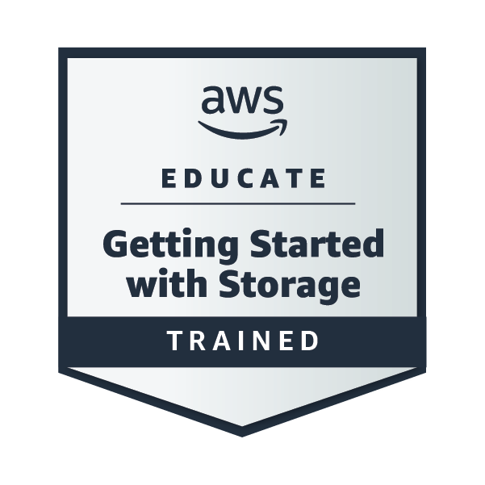
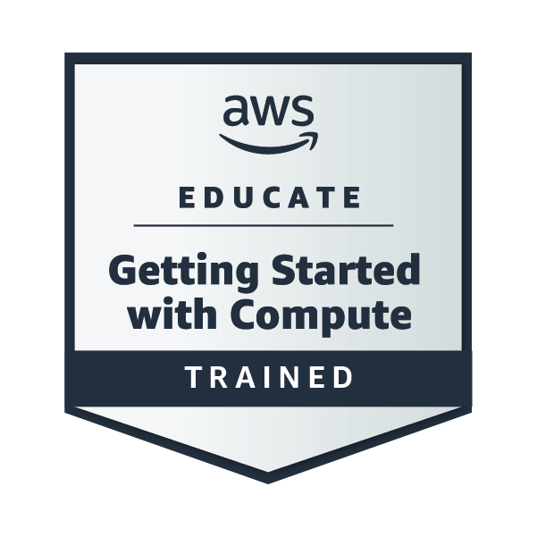
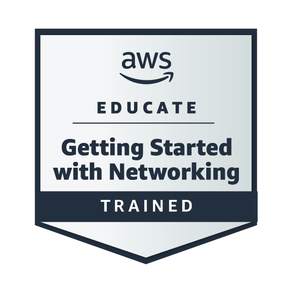

# Hi there! I'm Nalama 👋

Software Developer focused on **Cloud Computing**, **.NET** and **Data Engineering**.
Currently, I am expanding my knowledge through **AWS Educate**.

 ### 🚀 My Cloud Achievements:
| Getting Started with Security | Getting Started with Storage | Getting Started with Compute | Getting Started with Networking |
| :---: | :---: | :---: | :---: |
|  |  |  |  |

 [Verify my badges on Credly](https://www.credly.com/users/lorena-dev)

---

💻 **Software Developer | .NET | SQL | AI & Machine Learning Enthusiast**  

I’m a passionate software developer with professional experience building enterprise applications using **C#, .NET Core, ASP.NET MVC, and SQL Server**.  
Currently, I’m expanding my skills toward **Data Engineering, Machine Learning, and MLOps**, combining my strong backend foundation with modern AI technologies.  

---

### 🚀 About Me
- 👀 **Interests:** Software architecture, backend development, data pipelines, AI, and automation.  
- 🌱 **Currently learning:** Python for data science, Machine Learning fundamentals, and cloud tools (Azure, Databricks).  
- 💞️ **Looking to collaborate on:**  
  - .NET Core Web API and Blazor projects  
  - AI / Machine Learning applied to business automation  
  - Open-source projects related to clean architecture or MLOps  
- 🧠 **Tech mindset:** Clean architecture, SOLID principles, design patterns (Factory, Repository, Strategy).  
- 📫 **Reach me at:** [acujilem@espol.edu.ec]  

---

### 🛠️ Tech Stack
**Languages & Frameworks:**  
C#, VB.NET, .NET Core, ASP.NET MVC, Blazor, Razor Pages, SQL Server, JavaScript, HTML5, CSS3  

**Data & AI:**  
Python (pandas, numpy), SQL, Azure Data Factory (learning), Databricks (learning)  

**Tools & Practices:**  
Git, GitHub, Docker, Azure DevOps, RESTful APIs, CI/CD, Clean Architecture  

---

### 🏆 Featured Projects
🔹 [Design Patterns in Python](https://github.com/nalama1/design-patterns-python)  
Implementation of the Factory Method pattern demonstrating scalable object creation for various game types.  

*(More projects coming soon — focused on .NET APIs and data engineering pipelines!)*  

---

### 🌍 My Vision
> “Building reliable and scalable software that connects traditional development with the power of AI.”  

---

⭐ *If you like my work, consider following me or collaborating on AI + .NET projects!*

<!---
alexiscro/alexiscro is a ✨ special ✨ repository because its `README.md` (this file) appears on your GitHub profile.
You can click the Preview link to take a look at your changes.
--->
